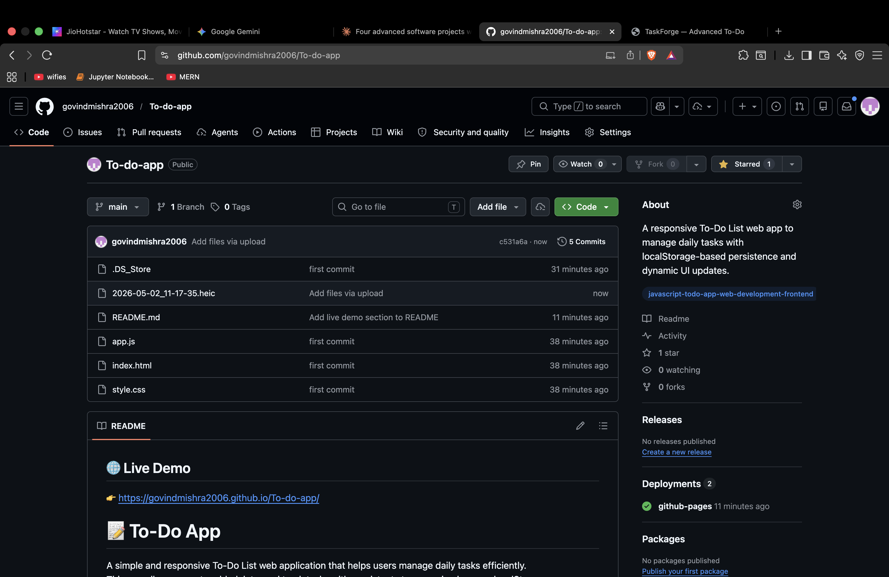

## 🌐 Live Demo

👉 https://govindmishra2006.github.io/To-do-app/

# 📝 To-Do App

A simple and responsive To-Do List web application that helps users manage daily tasks efficiently.  
This app allows users to add, delete, and track tasks with persistent storage using browser localStorage.

---

## 🚀 Features

- ➕ Add new tasks  
- ❌ Delete tasks  
- ✔️ Mark tasks as completed  
- 💾 Data persistence using localStorage  
- ⚡ Instant UI updates  
- 📱 Simple and clean user interface  

---

## 🛠️ Tech Stack

- HTML  
- CSS  
- JavaScript  

---

## 📂 Project Structure

To-do-app/
│── index.html  
│── style.css  
│── script.js  

---

## ▶️ How to Run

1. Clone the repository:
git clone https://github.com/govindmishra2006/To-do-app.git
2. Open the folder:
cd To-do-app
3. Open `index.html` in your browser

---

## 💡 How It Works

- Tasks are stored in **localStorage**
- JavaScript dynamically updates the DOM
- Every change (add/delete) updates both UI and storage  

---

## 🔮 Future Improvements

- Edit tasks  
- Task filtering (completed / pending)  
- Due dates and priority levels  
- Better UI design  

---

## 👨‍💻 Author

**Govind Gopal Mishra**

---

## ⭐ Show your support

If you like this project, give it a ⭐ on GitHub!
